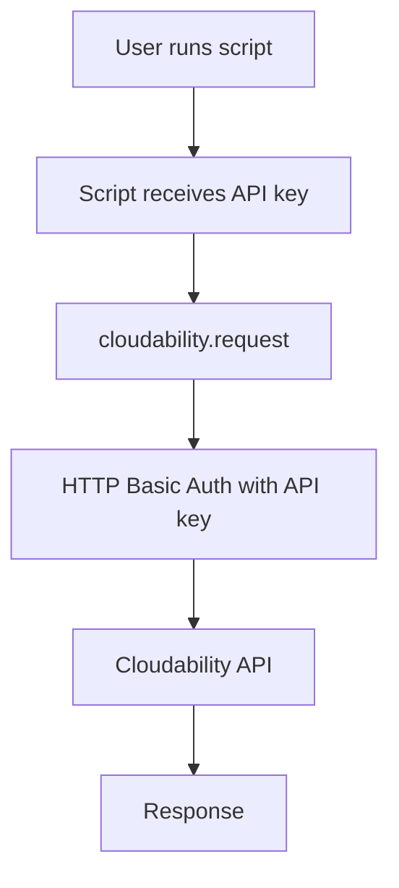
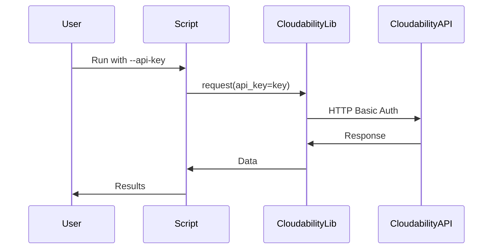
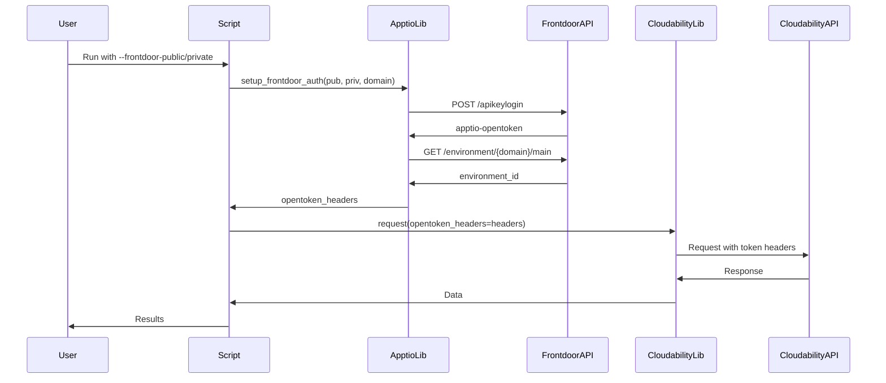
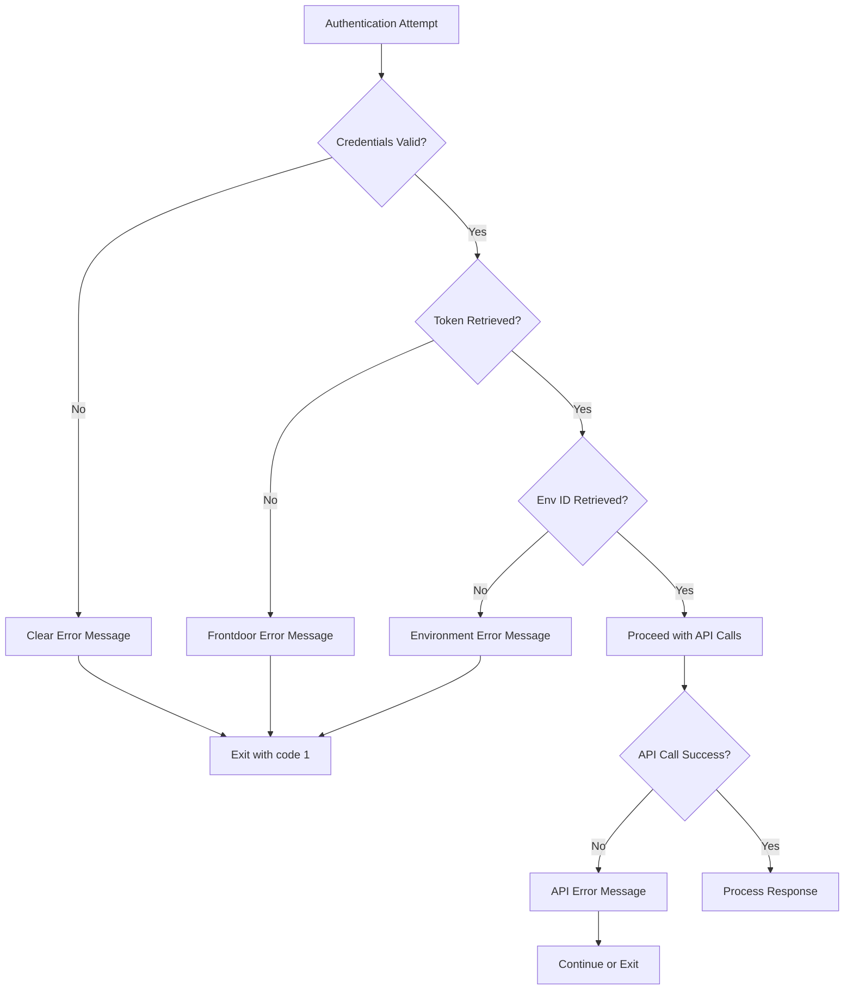

# Authentication Architecture

## Current Architecture (API Key Only)



## New Architecture (Dual Authentication Support)

```mermaid
graph TD
    A[User runs script] --> B{Authentication Method?}
    
    B -->|API Key| C[Use API Key]
    B -->|Frontdoor Keys| D[Use Frontdoor Auth]
    
    C --> G[cloudability.request]
    
    D --> D1[apptio.get_auth]
    D1 --> D2[POST to frontdoor/apikeylogin]
    D2 --> D3[Receive apptio-opentoken]
    D3 --> D4[apptio.get_environment_id]
    D4 --> D5[GET environment/{domain}/main]
    D5 --> D6[Receive environment ID]
    D6 --> D7[Create opentoken_headers]
    D7 --> G
    
    G --> H{Has opentoken_headers?}
    H -->|Yes| I[Use Token Headers]
    H -->|No| J[Use Basic Auth]
    
    I --> K[Cloudability API]
    J --> K
    K --> L[Response]
```

## Authentication Flow Details

### Option 1: Cloudability API Key Flow



### Option 2: Frontdoor Authentication Flow



## Component Responsibilities

### apptio_lib/apptio.py
- **Existing Functions**:
  - `get_auth()` - Obtain token from frontdoor
  - `token_getter()` - POST to frontdoor API
  - `make_opentoken_headers()` - Create headers
  
- **New Functions**:
  - `get_environment_id()` - Get env ID from domain
  - `setup_frontdoor_auth()` - Complete auth setup

### apptio_lib/cloudability.py
- **Existing Functions** (no changes needed):
  - `request()` - HTTP request wrapper
  - `get()`, `put()`, `post()`, `delete()` - HTTP methods
  - Already supports `opentoken_headers` parameter
  - Already handles auth switching

### Individual Scripts
- **New Responsibilities**:
  - Parse authentication arguments
  - Choose authentication method
  - Setup authentication
  - Pass credentials to library functions

## Data Flow

### Authentication Data Structure

```python
# API Key Method
api_key = "your_cloudability_api_key"
opentoken_headers = {}

# Frontdoor Method
api_key = None
opentoken_headers = {
    "apptio-opentoken": "token_value",
    "apptio-current-environment": "env_id_value",
    "Content-Type": "application/json",
    "Accept": "application/json"
}
```

### Request Headers Comparison

**With API Key**:
```http
GET /v3/account_groups HTTP/1.1
Host: api.cloudability.com
Authorization: Basic <base64(api_key:)>
Accept: application/json
```

**With Frontdoor Auth**:
```http
GET /v3/account_groups HTTP/1.1
Host: api.cloudability.com
apptio-opentoken: <token>
apptio-current-environment: <env_id>
Content-Type: application/json
Accept: application/json
```

## Regional Support

### Frontdoor URLs by Region

| Region | Frontdoor URL |
|--------|---------------|
| US (default) | `https://frontdoor.apptio.com` |
| EU | `https://frontdoor-eu.apptio.com` |
| APAC | `https://frontdoor-au.apptio.com` |
| Middle East | `https://frontdoor-me.apptio.com` |

### Cloudability API URLs by Region

| Region | API URL |
|--------|---------|
| US (default) | `https://api.cloudability.com` |
| EU | `https://api-eu.cloudability.com` |
| APAC | `https://api-au.cloudability.com` |

## Error Handling Flow



## Security Considerations

### Credential Storage Priority

1. **Command Line Arguments** (highest priority)
   - Visible in process list
   - Use for testing only

2. **Environment Variables** (recommended)
   - Not visible in process list
   - Can be set in shell profile
   - Can use `.env` files

3. **Configuration Files** (not implemented)
   - Would need proper file permissions
   - Risk of accidental commit to git

### Best Practices

- ✅ Use environment variables for production
- ✅ Never commit credentials to git
- ✅ Rotate keys regularly
- ✅ Use separate keys for different environments
- ✅ Monitor key usage and expiration

## Backward Compatibility

### Old Command Format (Still Supported)

```bash
# This continues to work
python update_ag_entries.py YOUR_API_KEY
```

Internally converted to:
```python
args.api_key = sys.argv[1]
```

### New Command Format

```bash
# Explicit API key
python update_ag_entries.py --api-key YOUR_API_KEY

# Frontdoor authentication
python update_ag_entries.py \
  --frontdoor-public YOUR_PUBLIC \
  --frontdoor-private YOUR_PRIVATE \
  --domain your-domain
```

## Testing Matrix

| Auth Method | Region | Script | Status |
|-------------|--------|--------|--------|
| API Key | US | update_ag_entries.py | ⏳ Pending |
| API Key | EU | update_ag_entries.py | ⏳ Pending |
| Frontdoor | US | update_ag_entries.py | ⏳ Pending |
| Frontdoor | EU | update_ag_entries.py | ⏳ Pending |
| API Key | US | update_mappings_from_csv.py | ⏳ Pending |
| Frontdoor | US | update_mappings_from_csv.py | ⏳ Pending |
| API Key | US | update_hbm.py | ⏳ Pending |
| Frontdoor | US | update_hbm.py | ⏳ Pending |
| API Key | US | views_updater.py | ⏳ Pending |
| Frontdoor | US | views_updater.py | ⏳ Pending |